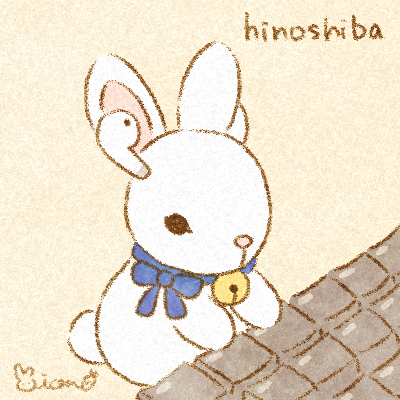
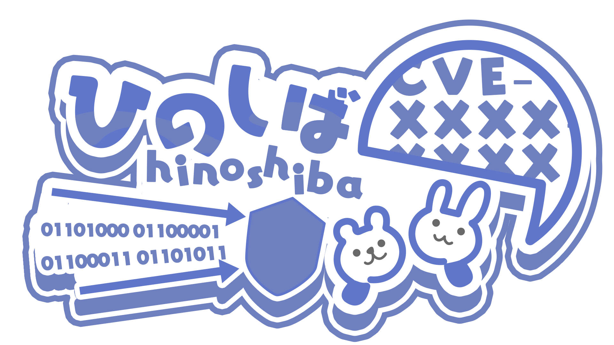

AboutMe
===

  

hinoshibaか、ShungoKumasaka([芸名？](https://hinoshiba.hatenablog.com/entry/2019/11/17/100616))として、IT なことしています。  
サムネに使っているイラストは、ラビットダッキング相棒のうさぎさんのぬいぐるみをモチーフに描いていただきました。うさぎさんの名前は、「はーちゃんうーちゃん」。その子の夫は、クマさんの"あらい"と言います。  

僕の具体的な活動は、[o-post](./o-post/) 辺りに雑にまとめています。  
また、個人のブログ関係は、[post](./post/) に投稿をまとめています。  

## 連絡先(Contacts)
1. [Twitter](https://twitter.com/hinoshiba)
	* DM or 公開リプライ
2. E-MAIL:`s.k.noe@hinoshiba.com`
	* [公開鍵はこちら](./pubkeys/)

## IT以外でとても興味があること

* ドラマ: [DoctorWHO](https://www.doctorwho.tv/)
* アニメ/文庫: 灼眼のシャナ
* 特撮: [仮面ライダー](https://www.kamen-rider-official.com/collections)
	* 守備範囲は、クウガ ~ ゼロワン
* ぬいぐるみ: [ご当地ベア](https://www.fujisey.com/gotouchibear/)

  

# 画像のライセンス

## サムネイルについて

サムネイル発注先は、Mion様([Twitter](https://twitter.com/pom_vouov) / [HP](https://mions-art.com/)) です。  
所有権は私が保持し、個人/商用利用及び、所有権を示す目的に限った[NFT化](https://opensea.io/collection/hinoshiba) に関する本イラストの使用をMion様と契約しております。 著作権は、Mion様が有します。  

## ヘッダ等の画像について

ヘッダ等の画像発注先は、さわらつき様([Twitter](https://x.com/sawaratsuki1004) / [Skeb](https://skeb.jp/@sawaratsuki)) です。  
契約に関する情報は、[こちら](https://skeb.jp/@sawaratsuki/works/10) の通りです。  
さわらつき様は、[こちらで他の作品も公開されています。](https://github.com/SAWARATSUKI/KawaiiLogos)  
